# Title of the Invention

Systems and Methods for Deterministic Gather-Centric, Residency-First Hierarchical Management of Key-Value Cache State for Autoregressive Neural Network Inference

## Field of the Invention

The present disclosure relates to memory architecture, inference runtime systems, accelerator control, and machine learning serving infrastructure. More particularly, the disclosure relates to systems and methods for managing live inference state for autoregressive neural network inference by treating key-value state as logically addressed, shared, tiered, format-aware memory objects and by deterministically gathering such logically shared, tiered, and format-diverse objects into execution-ready tiles, buffers, or descriptors for neural attention or related compute operations.

## Background and Technical Context

Autoregressive neural network inference commonly requires repeated access to previously generated or previously processed context. In attention-based neural architectures, such historical context is represented by key-value state associated with prior tokens, positions, windows, or latent units. As context length, concurrency, and branching increase, management of such state becomes a primary systems problem.

In practical deployments, inference is rarely limited to a single short isolated sequence. Serving platforms may process many simultaneous sessions, large shared prompts, long conversational histories, resumable sessions, branch-heavy speculative workflows, tool-augmented agent execution, and distributed execution across multiple accelerators. Under such conditions, historical inference state is not merely an auxiliary tensor. It is a large, evolving, shared, service-critical operating substrate.

Conventional implementations often store KV state as flat per-sequence tensors or similar append-oriented allocations. Other implementations may rely on generic hardware caches to opportunistically capture locality. Still other implementations may introduce page-oriented allocation schemes or compression of historical state. However, such approaches generally do not provide a complete architectural treatment of live inference state as a logically named, explicitly managed object domain in which placement, sharing, relocation, representation, and compute preparation are jointly governed.

The present disclosure is based on the recognition that the key bottleneck is not only storage capacity, and not only memory bandwidth, but also the absence of a deterministic, architecture-level mechanism for transforming logically shared, physically fragmented, multi-tier, and format-diverse inference state into regular execution-ready structures. In other words, the invention treats deterministic gather of live inference state as a first-class architectural problem and solution.

In preferred embodiments, KV state is not merely stored. It is blockized, logically addressed, shared through prefix-aware lineage structures, placed across tiers under explicit residency policy, optionally represented differently by tier, and then deterministically gathered into compute-ready tiles or descriptors by a dedicated gather control path. The gather path is central: it is the mechanism by which logically irregular state is rendered execution-regular without burdening the compute kernel with metadata traversal, branch resolution, representation discovery, or residency arbitration.

## Problems in Existing Systems

Existing inference systems, particularly for long-context and multi-session autoregressive serving, may exhibit one or more of the following deficiencies.

A first problem is uncontrolled growth of KV footprint with context length, concurrency, branch count, and resumability requirements.

A second problem is duplication of shared prompt or shared prefix state across sessions and branches, which increases occupancy of costly hot or warm memory tiers.

A third problem is over-reliance on generic hardware caching, which ordinarily operates on low-level memory access locality without explicit knowledge of logical sequence structure, branch lineage, prefix reuse, service class, or representation transform requirements.

A fourth problem is the use of flat per-sequence KV tensors that assume a direct and often static correspondence between logical sequence identity and physical placement, thereby making sharing, relocation, distributed ownership, and resumable migration cumbersome.

A fifth problem is that page-based or block-based allocation alone does not solve the execution problem. Even if allocation is non-contiguous, the runtime must still assemble logically correct and execution-efficient historical state for each inference step.

A sixth problem is that compression-only approaches reduce capacity footprint but do not provide explicit logical namespace management, deterministic reconstruction planning, branch-aware ownership, or compute-facing regularization.

A seventh problem is that distributed prompt stores or prefix stores, when used without hierarchical logical mapping and deterministic gather planning, may cache prompt artifacts but still fail to provide coherent management of branch-local suffixes, multi-tier representations, remote/local ownership transitions, or execution preparation under latency constraints.

An eighth problem is unpredictable latency caused by reactive or best-effort retrieval. When required historical state spans multiple tiers or devices, conventional systems may incur variable stalls because retrieval order, decompression sequence, and staging layout are not compiled into a deterministic execution-preparation plan.

A ninth problem is that compute kernels may be exposed to irregularity. If the compute plane must resolve metadata, follow ownership indirections, or adapt dynamically to compressed and distributed storage formats, kernel efficiency and predictability may degrade.

A tenth problem is that compaction, relocation, suspend/resume, and migration are difficult when logical state is entangled with fixed physical allocations rather than being mediated through a robust logical mapping layer with commit-safe transitions.

Accordingly, a need exists for an inference-state architecture in which logically shared, tiered, and format-diverse KV objects are deterministically gathered into execution-ready structures through a distinct control path, while placement, sharing, and format changes remain transparent to compute execution.

## Summary of the Invention

The present disclosure provides systems and methods in which deterministic gather of logically managed KV objects into execution-ready tiles or descriptors constitutes the central mechanism for autoregressive neural network inference.

In one embodiment, KV state is partitioned into logical blocks or extents, each associated with token ranges and model subspaces such as layer, head, head group, channel group, or combinations thereof. Each unit is assigned a logical identity independent of current physical location and independent of whether one or more physical representations presently exist.

In one embodiment, a residency-first hierarchical management substrate maintains a logical namespace and maps each logical KV object to one or more physical placements across multiple tiers. Such tiers may include on-chip SRAM or local memory, HBM or device DRAM, host DRAM, pooled or coherent-fabric memory, remote device memory, and storage-backed memory. The hierarchical management substrate supports deterministic gather by recording representation type, compression state, version epoch, ownership lineage, pin state, relocation state, distributed ownership, and gather-relevant formatting information.

In one embodiment, a prefix-sharing and branch manager represents common prompts and historical sequence segments as shared lineage structures, including prefix trees, DAGs, branch graphs, or related forms, so that deterministic gather may assemble shared and branch-local historical state without requiring physical duplication.

In one embodiment, a residency controller governs placement, promotion, demotion, prefetch, replication, pinning, and representation transitions according to policy, whereby residency-first hierarchical management acts as an enabling substrate for deterministic gather rather than as an independent end in itself.

In one embodiment, a deterministic gather engine receives logical access requirements for an inference step, traverses metadata structures in the control plane, resolves shared lineage, identifies required representations and locations, compiles a gather plan, schedules overlapping retrieval from mixed tiers, invokes decompression or reformatting where needed, and emits execution-ready tiles, buffers, streams, or descriptors. In preferred embodiments, the compute plane does not walk metadata structures directly.

In one embodiment, gather planning is plan-compiled and optionally template-reusable. Gather templates may be reused for recurrent access shapes, subject to metadata version and residency checks. Mixed-tier overlap scheduling may be used to overlap cold-tier fetch, remote fetch, warm-tier transfer, decompression, and output tile assembly.

In one embodiment, metadata commit and epoch mechanisms enable safe relocation, compaction, migration, and representation switching without invalidating logical identity or exposing compute kernels to transient inconsistency during deterministic gather validation and source binding.

The invention accordingly resides in deterministic gather of logically managed KV objects into execution-ready artifacts, together with the residency-first hierarchical management substrate that makes such deterministic gather correct, repeatable, and efficient across shared, tiered, and format-diverse historical state.

## Statement of the Invention

According to one aspect of the present invention there is provided a computer-implemented system and method for autoregressive neural network inference, wherein key-value state is maintained as logically managed objects addressable through hierarchical metadata and wherein a deterministic gather mechanism resolves said logically managed objects, including shared, tiered, compressed, relocated, and remotely owned objects, into execution-ready tiles, buffers, or descriptors for attention or related compute operations. In one embodiment, residency-first hierarchical KV management provides the control substrate for naming, ownership, placement, versioning, representation control, promotion, demotion, replication, and relocation of said objects, and deterministic gather provides the execution-preparation path by which such objects are transformed into compute-consumable form without requiring the compute kernel to traverse the metadata hierarchy directly.

## Brief Statement of Technical Advantages / Technical Effects

In some embodiments, the disclosed architecture reduces duplication of common prompt and branch-prefix state by representing historical KV as shared logical objects with explicit ownership and lineage, rather than duplicating equivalent per-sequence tensors.

In some embodiments, hot-tier pressure is reduced because the residency-first hierarchical management substrate permits only the most latency-sensitive and gather-critical objects to occupy the hottest tier, while colder or shared historical state remains available for deterministic gather from warm or cold tiers.

In some embodiments, execution preparation becomes more predictable because the gather path is compiled and ordered. Instead of ad hoc retrieval from whatever locations happen to contain relevant data, the runtime constructs a deterministic plan specifying source resolution, transfer order, overlap, decompression, format conversion, and final layout.

In some embodiments, better QoS control is achieved because the substrate exposes policy-aware residency, pinning, and source-selection controls to the deterministic gather path. Latency-sensitive sessions, premium classes, shared hot prefixes, and high-probability branches may therefore receive differentiated gather treatment under explicit policy.

In some embodiments, long-context serving is improved because historical context may reside across multiple tiers and representations while remaining logically addressable and gatherable into execution-ready form when needed.

In some embodiments, branch-heavy serving is improved because shared ancestors are retained once, divergence is localized to suffix objects, and the gather engine can deterministically combine shared and branch-local state during execution preparation.

In some embodiments, relocation and compaction are safer and less disruptive because logical mapping is decoupled from physical placement and governed by epoch-based metadata commit rules.

In some embodiments, distributed serving is improved because remote ownership, selective replication, and replica-versus-fetch decisions are made using logical object identity and gather-aware policy rather than opaque cache behavior.

The foregoing technical effects arise from deterministic gather of logically managed KV objects, supported by residency-first hierarchical management, rather than from simple enlargement of memory or generic reuse mechanisms.

## Glossary / Definitions

“KV object” means a logically identified unit of historical inference state, including a block, extent, segment, or grouped collection of keys and/or values.

“Deterministic gather” means a control-plane-managed operation that resolves logically named KV objects, determines their physical sources and representation transforms, and assembles them into a defined execution-ready output according to a stable and policy-governed plan.

“Execution-ready tile” means a buffer, tile, tensor view, stream unit, or descriptor arrangement suitable for direct or near-direct use by an attention or related compute operator.

“Gather template” means a reusable plan skeleton or compiled gather pattern associated with a logical access shape, subject to source validation, epoch checks, and address rebinding.

“Epoch transition” means a metadata commit mechanism by which logical-to-physical mappings change from one valid version to another while preserving reader correctness.

“Seal state” means whether a KV object is closed to further append or update and therefore eligible for immutable sharing, migration, replication, or archival treatment.

“Residency-first” means an architectural approach in which placement of live inference state across tiers is explicitly managed using logical semantics and policy, rather than left primarily to generic hardware caches or incidental allocator state.

## Detailed Description of the Invention

The invention will now be described in greater detail, deterministic gather being the central architectural theme.

In autoregressive inference, historical KV state may be physically fragmented, logically shared, represented in different formats across tiers, and subject to relocation, compression, or remote ownership. Attention or related compute operators, however, require regular execution-ready inputs. The disclosed system addresses this by providing deterministic gather as the operative mechanism that transforms logically managed KV objects into execution-ready form.

In preferred embodiments, all significant irregularity is absorbed in the metadata and gather control plane. Logical sharing, branch lineage, mixed residency, representation diversity, relocation, and remote ownership are resolved before compute launch. The output of the gather engine is therefore a normalized execution artifact. This separation is fundamental and repeatedly distinguishes the invention from systems that either rely on generic caching to make data “happen to be local,” or expose the compute plane to irregular pointer chasing and format handling.

In one embodiment, each sequence or branch references a lineage structure. The lineage structure points to logical KV objects identified by token range and model subspace. Such objects need not be physically contiguous and need not exist in a single tier or a single representation. They may exist as a hot working copy, a warm reduced-precision copy, a cold compressed copy, or a remote owned copy. The hierarchical metadata manager records these possibilities.

When a decode step is scheduled, the compute plane does not inspect lineage trees, residency tables, or format records directly. Instead, a decode request is delivered to the gather engine. The gather engine resolves the logical request into a finite set of source objects. It determines which sources are already hot and directly consumable, which require transfer from warm memory, which require decompression from cold memory, which are remotely owned, and which may be served from local replicas. It then compiles a staged gather plan.

The gather plan may be compiled in multiple phases. A first phase performs logical resolution and metadata snapshotting. A second phase binds candidate physical sources, including replica choice if multiple valid sources exist. A third phase selects representation transforms and output packing paths. A fourth phase schedules transport and transformation overlap. A fifth phase emits execution-ready descriptors and synchronization fences. A sixth phase records post-gather statistics for policy feedback.

In one embodiment, the gather plan is deterministic in the sense that, given a logical request, a metadata snapshot, and policy state, the resulting source ordering, transform ordering, and output layout are stable according to declared rules. Such rules may include token-order precedence, layer-order precedence, head-group packing order, preferred local-over-remote source choice, and transform minimization preferences. Determinism is useful not only for correctness and predictability but also for template reuse and QoS budgeting.

In one embodiment, the metadata manager supports read epochs and commit epochs. A gather plan is compiled against a read epoch or metadata snapshot ID. If no intervening incompatible transition occurs, the plan remains valid. If relocation, demotion, or representation transition modifies one of the required sources, the change is published under a later commit epoch. The gather engine may validate source epochs before launch and either rebind the affected sources or regenerate the plan. In some embodiments, upper portions of the plan remain reusable while only changed sources are rebound.

In one embodiment, metadata commit uses a two-stage publish protocol. A new physical representation or location is first produced and validated. The metadata entry is then updated in shadow form with a next-epoch source descriptor. Once consistency conditions are met, a commit marker advances the authoritative mapping epoch. Readers already holding the prior epoch may complete using prior bindings, while new gathers use the new epoch. Source reclamation is deferred until all prior-epoch readers drain or a quiescence condition is met. This enables safe relocation, compaction, and representation switching without exposing torn mappings.

In one embodiment, relocation safety is maintained using one or more of: shadow-copy plus atomic pointer swap, epoch-guarded reader sets, lease-based source retention, double-resident transition windows, or relocation descriptors with validation and rollback state. Because compute kernels do not directly discover sources, relocation can remain entirely hidden behind the gather path and metadata layer.

The architecture may accordingly be understood as an inference-state management arrangement in which logical state is named, ownership is tracked, placement is policy-governed, representation is explicit, movement is scheduled, and execution preparation is performed by deterministic gather.

## Architecture Overview

In one embodiment, the system comprises:

- a KV Block Manager responsible for creating, sealing, extending, and versioning logical KV objects;
- a Hierarchical Metadata Manager responsible for logical naming, mapping, epoch management, and source publication;
- a Prefix Sharing and DAG Manager responsible for common-prefix and branch ownership semantics;
- a Residency Controller responsible for promotion, demotion, pinning, prefetch, representation transitions, and QoS-aware policy;
- a Compression and Representation Manager responsible for tier-specific format management and reconstruction paths;
- a Deterministic Gather Engine responsible for gather-plan compilation, source binding, overlap scheduling, output regularization, and template reuse;
- an Attention or Compute Interface responsible for accepting execution-ready tiles or descriptors without direct metadata traversal;
- an Allocator and Compaction Manager responsible for tier-local space management, fragmentation control, and safe relocation;
- an optional Distributed Fabric and Global KV Namespace Manager responsible for remote ownership records, replica selection, and cross-device source policy; and
- a Runtime Scheduler Integration layer responsible for decode requests, service classes, branch hints, suspend/resume events, and predicted access windows.

The preferred division is between a control plane and a compute plane. The control plane resolves logical identity, ownership, residency, epoch validity, and transform requirements so that deterministic gather may compile and validate execution-preparation plans. The compute plane consumes the normalized result of deterministic gather. This distinction is central to the architecture.

## Detailed Description of Components

### A. KV Block Manager

In one embodiment, the KV Block Manager maintains logical KV objects as appendable, sealable units. Blocks may be fixed-size or variable-size. Fixed-size blocks can simplify allocation and gather template reuse. Variable-size extents can reduce metadata overhead for stable prompt regions and support compression-friendly packing.

Open blocks accept append operations for newly generated tokens. When a block becomes full, reaches a policy threshold, encounters a branch transition, or requires sealing for sharing, the block manager seals the block. A sealed block becomes immutable historical state and is eligible for broader sharing, demotion, replication, compression, or remote export.

Each block descriptor may include logical ID, token range, layer/head grouping, append state, seal state, generation epoch, representation references, and logical ownership references. In some embodiments, an open block and its eventual sealed descendant retain lineage linkage for audit and rollback.

### B. Hierarchical Metadata Manager

In one embodiment, the metadata manager maintains authoritative logical-to-physical mappings and their epoch history. Possible structures include radix trees, B+-trees, page-table-like hierarchies, extent maps, or hybrids.

A mapping entry preferably includes:

- logical object identity;
- current authoritative epoch;
- previous committed epoch if still draining;
- current source descriptor set;
- representation descriptor set;
- tier residence bitmap;
- pin and reservation counts;
- ownership and lineage indicators;
- last validated checksum or integrity marker where used;
- migration or relocation state; and
- distributed ownership and replica metadata where applicable.

Source descriptors may include tier identifier, device identifier, physical address or extent reference, layout code, transform prerequisite, validity interval, and access-cost estimate.

Epoch transitions are preferably explicit. In one embodiment, every mapping entry has a read-stable current pointer and an optional pending-next pointer. A relocation or representation transition first populates the pending-next pointer with a validated destination descriptor. Commit then increments the epoch and flips current to pending-next, after which the old source remains retired-but-readable until all dependent readers drain.

In another embodiment, metadata pages themselves are versioned, and gather compilation reads from an immutable metadata snapshot. Compaction or migration writes new leaf pages and then updates parent pointers in a copy-on-publish fashion.

### C. Prefix Sharing / DAG Manager

In one embodiment, the prefix manager stores a lineage DAG in which common ancestors are explicit shared nodes. Each shared node may summarize descendant count, active session count, popularity score, hotness floor, and branch fan-out. Such summary fields can directly influence residency policy and gather planning.

Where a branch diverges from a shared prefix, the system maintains shared references to sealed ancestors and creates new branch-local suffix objects. If divergence occurs while an appendable object is open, the system may force a seal at the divergence boundary and create separate branch-local open objects thereafter.

In some embodiments, branch identities are included in gather-plan keys so that shared ancestors and branch-local suffixes are assembled in one deterministic output order.

### D. Residency Controller

The residency controller is responsible not just for “keeping data near compute” but for ensuring that the gather engine can reliably produce execution-ready outputs under policy constraints.

The controller may maintain per-tier budgets, per-class quotas, per-object promotion scores, and gather-criticality scores. An object may have high gather-criticality if it appears frequently in near-future gather plans, is expensive to reconstruct from cold form, or has high fan-out across active lineages.

QoS-aware policy may consider latency class, tenant class, branch priority, suspend state, and shared-prefix value. The controller may expose policy records that specify:

- hot-tail pin depth;
- shared-prefix protection level;
- remote fetch tolerance;
- replicate-on-second-use or replicate-on-threshold behavior;
- compression eligibility;
- resume prewarm depth; and
- cold-tier archival mode.

### E. Compression and Representation Manager

The representation manager tracks how an object is stored and how it can be made execution-ready. This may include direct-execution formats, gather-native staging formats, warm compact formats, and cold archival formats.

Each representation record may include:

- format identifier;
- precision or quantization parameters;
- packing scheme;
- group size or tile size;
- transpose or swizzle state;
- direct-stream capability;
- reconstruction kernel identity;
- expected expansion size; and
- transformation latency estimate.

This information is essential to deterministic gather. A gather plan must know not merely where an object resides, but what must happen to convert it into the output tile or descriptor expected by the compute interface.

### F. Deterministic Gather Engine

This is the central component of the architecture.

In one embodiment, the gather engine receives a logical access request specifying sequence lineage, step number, model slice, and required historical range. It acquires a metadata snapshot or read epoch, resolves the necessary logical objects, and partitions them into gather segments.

A gather segment may correspond to one logical object or a coalesced group of adjacent compatible objects. Coalescing rules may consider token adjacency, shared tier, shared representation, common source device, identical transform requirements, and output contiguity.

The engine then compiles a gather plan. Compilation may include:

- logical dependency expansion;
- source binding;
- replica/source selection;
- transform-path selection;
- phase partitioning;
- transport scheduling;
- output placement assignment; and
- fence and dependency generation.

Gather-plan compilation is preferably more than a linear list of fetches. In one embodiment, it constructs a directed acyclic execution graph whose nodes represent source fetches, decompression actions, local copies, remote transfers, tile writes, and completion fences. Edges represent dependencies. The graph may then be topologically scheduled subject to tier bandwidth budgets and latency objectives.

Reusable gather templates may be used where access shapes recur. A template may encode ordered logical segments, expected transform classes, output layout, and abstract source slots. On reuse, the engine validates that:

- the logical lineage structure has not changed incompatibly;
- the necessary source objects remain resolvable under acceptable epochs;
- the source format classes still match the template; and
- required output dimensions are unchanged.

If validation succeeds, only source rebinding and current-address patching are required.

Mixed-tier overlap scheduling is a preferred feature. In one embodiment, hot-tier reads are launched immediately, warm-tier transfers begin in parallel, remote or cold-tier reads are started earliest due to greater latency, and decompression tasks are placed to overlap with incoming transfers. Tile assembly proceeds incrementally as prerequisite segments arrive. The scheduler may maintain separate queues per tier and a global plan deadline. It may prioritize segments on the critical path of compute launch.

Remote fetch versus local replication decisions may be integrated during source binding. If a segment is remotely owned, the engine or associated policy layer estimates expected reuse, transfer latency, available local space, replication cost, and branch/session priority. A one-time low-value access may remain a remote stream source. A high-value repeated access may trigger replica instantiation in warm or hot local memory and update metadata accordingly.

### G. Attention / Compute Interface

The compute interface consumes finalized outputs of the gather engine. In preferred embodiments, the compute kernel accepts contiguous tiles, normalized staging buffers, or stream descriptors that already encode the required order and format. The compute interface is shielded from logical object management, epoch tracking, replica policy, and representation discovery.

In some embodiments, the execution-ready output need not be limited to materialized tiles or buffers. The gather engine or associated front-end logic may emit descriptor programs, DMA chains, ordered stream descriptors, or hardware front-end command structures that define retrieval order, transform order, staging destination, and consumption order for the compute unit.

This separation is a significant distinguishing feature. In the disclosed architecture, compute regularity is preserved not by forcing all state into a flat tensor, but by maintaining logical flexibility in storage and deterministically regularizing such state before execution.

### H. Allocator / Compaction / Defragmentation Manager

The allocator may maintain separate pools by tier and, in some embodiments, by representation class. Fixed-size hot working objects may be placed in slot pools. Variable-size cold compressed objects may use extent trees or segmented logs. Fragmentation metrics may be fed back to residency policy and gather planning.

Relocation safety is important because execution correctness must be preserved during compaction. In one embodiment, relocation proceeds as follows:

1. identify candidate object and destination;
2. allocate destination space;
3. copy or reconstruct object to destination;
4. validate destination integrity and format;
5. publish a pending-next source descriptor;
6. advance mapping epoch at commit;
7. retain prior source until all prior-epoch gathers drain; and
8. reclaim prior source.

This process allows compaction without breaking logical references or disrupting in-flight gather plans.

### I. Distributed Fabric / Global KV Namespace

In distributed embodiments, the global namespace preserves logical object identity across multiple accelerators or nodes. A distributed ownership record may include owner device, replica set, seal state, current epoch, and popularity metrics. Remote or replicated sources are therefore just different physical instantiations of the same logical object.

A distributed popular-prefix store may hold shared immutable prefixes referenced by many sessions. However, unlike a mere prompt store, the disclosed architecture also includes hierarchical logical mapping from shared prefix objects to branch-local suffix objects, plus deterministic gather planning that spans local and remote source segments.

### J. Runtime Scheduler Integration

The runtime scheduler provides the temporal context that makes deterministic gather effective. The scheduler can announce expected next steps, likely branch continuations, service classes, suspend or resume events, and budget constraints. The gather engine and residency controller use these signals to prebind likely sources, pin critical objects, or prewarm resume paths.
## Data Structures and Metadata Organization

### KV Object Descriptor

A KV object descriptor may include object ID, token start, token length, layer or layer-range, head-group range, seal state, append state, logical owner lineage, descendant branch count, current gather-criticality score, and list of active representation records.

### Metadata Mapping Entry

A mapping entry may include logical object key, current epoch, prior draining epoch if any, source descriptor array, replica descriptor array, transform-compatibility flags, pin count, reservation count, migration state, and policy class.

### Source Descriptor

A source descriptor may include, in one embodiment, source identifier, logical object identifier, source epoch, tier identifier, device or node identifier, memory-pool identifier, physical address or extent pointer, byte offset, byte length, token-range start, token-range length, layer range, head-group range, access path type, direct-read eligibility flag, DMA-read eligibility flag, remote-stream eligibility flag, compression prerequisite flag, decompression prerequisite flag, integrity marker, checksum or parity field where used, source validity state, last validation timestamp or epoch, expected access latency, expected bandwidth class, reservation count, and retirement status.

### Representation Descriptor

A representation descriptor may include, in one embodiment, representation identifier, representation class, numeric precision or quantization class, packing mode, tile shape, group size, transpose or swizzle code, direct-execution compatibility flag, direct-gather compatibility flag, decompression kernel identifier, reformat kernel identifier, expected expansion ratio, expected transform latency, loss profile indicator where applicable, canonical-output compatibility flag, source-tier suitability mask, and representation-version field.

### Epoch Transition Record

An epoch transition record may include object ID, old epoch, new epoch, old source set, new source set, publication timestamp, validation status, rollback indicator, reader-drain condition, and source reclamation eligibility.

### Gather Plan Descriptor

A gather plan descriptor may include plan ID, lineage ID, step number, metadata snapshot epoch, ordered logical segment list, bound source descriptors, phase schedule, overlap windows, transform actions, output tile placements, fallback sources, and completion conditions.

In one embodiment, the gather plan descriptor further includes plan generation identifier, logical request signature, template linkage identifier if derived from a template, ordered segment ordinals, per-segment output offsets, per-segment source epoch, per-segment transform chain, critical-path segment markers, launch deadline, latency-class field, bandwidth budget, staging-buffer assignments, DMA channel assignments, remote-transfer channel assignments, decompression queue assignments, fence identifiers, completion bitmap, fallback rebind policy, and invalidation conditions.

### Gather Template Descriptor

A gather template descriptor may include template ID, logical access shape signature, ordered abstract segment pattern, transform-class pattern, output layout contract, rebindable source slots, epoch-compatibility rules, and invalidation conditions.

In one embodiment, the gather template descriptor further includes model identifier, layer-set signature, head-group signature, token-window signature, branch-shape compatibility mask, required output tile geometry, abstract source-class slots, allowed tier classes per slot, required transform-class per slot, template-local ordering rule, rebind patch table, source-epoch tolerance rule, maximum allowable source substitution count, deterministic tie-break rule for replica selection, and template retirement condition.

### Remote Ownership / Replication Record

A distributed record may include global object ID, primary owner, replica set, last reuse count per device, replication desirability, link cost estimate, local admission threshold, and permitted direct-stream flags.

### Distributed Ownership Record

A distributed ownership record may include, in one embodiment, global object identifier, owner node or device identifier, owner epoch, seal state, mutability state, replica list, replica epochs, replica freshness indicators, invalidation generation, preferred source region, topology class, remote-fetch count, local-replication count, popularity score, reuse forecast, replica admission threshold, replica eviction priority, coherency mode, refresh-required flag, refresh deadline, and permitted direct-stream or stage-local restrictions.

## KV Lifecycle Management

A KV object may pass through the following lifecycle stages:

- creation;
- appendable open state;
- seal transition;
- shared historical state;
- tier movement;
- representation transition;
- remote export or replication;
- gather reservation;
- relocation;
- suspend archival;
- resume prewarm;
- reference release; and
- reclamation.

Throughout the lifecycle, the logical ID remains stable even if physical sources change. This stability is what enables deterministic gather to serve as the persistent bridge to execution.

## Memory Tiering and Residency Policy

In preferred embodiments, residency policy is evaluated in gather terms. That is, the controller does not merely ask whether an object was recently used, but whether future gather plans are likely to need the object and what the cost would be if it were absent from hotter tiers.

Promotion factors may include:

- inclusion in near-future gather windows;
- high branch fan-out;
- high session priority;
- high remote-fetch cost;
- high decompression cost; and
- global prefix popularity.

Demotion factors may include:

- low near-future gather probability;
- availability of lower-tier replicas;
- low service priority;
- pressure in hotter tiers; and
- reconstructability with acceptable latency.

The policy may therefore be described as gather-aware residency control forming part of the substrate that supports deterministic gather.

## Prefix Sharing / Branch Sharing / Session Sharing

Shared prefixes are preferably represented as immutable historical objects. Branches reference shared ancestors and add local suffixes. This structure benefits deterministic gather because the gather engine can assemble a single execution-ready historical view from shared and private objects without requiring physical duplication.

In some embodiments, prefix nodes maintain aggregate statistics such as active descendant count, accumulated gather frequency, and global popularity score. These metrics can directly influence both residency and remote replication policy.

## Deterministic Gather and Execution Preparation

This section is central to the invention.

For each decode or attention-consuming step, the runtime forms a logical request describing the historical state needed. The deterministic gather engine then performs:

1. logical expansion of lineage to required token ranges;
2. resolution of shared versus branch-local objects;
3. binding of current valid physical sources under a metadata epoch;
4. selection among multiple valid sources, including local versus remote alternatives;
5. selection of transform paths based on representation type;
6. construction of a phase-ordered execution-preparation plan;
7. overlap scheduling across tiers and transforms; and
8. regularized output emission.

Execution-ready outputs may be contiguous tiles, ring-buffer slots, DMA chains, packetized stream descriptors, or hardware front-end descriptors. The architecture is not limited to any particular output form. It is material that the output be normalized for compute consumption and derived through deterministic gather of logically managed objects.

In some embodiments, deterministic gather emits a programmatic execution artifact rather than a fully materialized buffer. Such execution artifact may comprise a descriptor program, a DMA command chain, an ordered stream descriptor set, or a hardware front-end command structure specifying the sequence in which source segments are to be fetched, transformed, staged, and consumed by the compute unit.

In one embodiment, the gather engine may precompute token-order segment slots and fill them as source segments arrive. In another embodiment, a descriptor-emitting gather unit emits ordered stream descriptors referencing staged fragments already guaranteed to satisfy compute ordering.

In one embodiment, a gather plan has critical-path awareness. Segments whose absence would block compute launch are prioritized. Segments outside the immediate critical prefix may continue arriving while compute begins if the compute interface supports streamed consumption. In another embodiment, full materialization is required before launch. The invention accommodates both.
## Compression-Aware Embodiments

Compression-aware embodiments are disclosed with emphasis on gather-time consequences.

A compressed object in a cold tier is not merely a smaller stored form. It is a source object whose inclusion in a gather plan requires a defined reconstruction or direct-stream transform path. The metadata records that path. The gather engine schedules that path.

In one embodiment, a compressed object is fetched from host DRAM, decompressed into a warm staging buffer, reformatted into compute layout, and then incorporated into the output tile. In another embodiment, direct-stream decompression writes decoded vectors into final tile offsets without a persistent intermediate copy.

## Distributed / Multi-Accelerator Embodiments

In distributed embodiments, deterministic gather may span local and remote sources. A gather plan may therefore include remote transfer nodes, replica-admission nodes, and topology-aware source choices.

A remote source may be used directly if expected reuse is low and latency budget permits. A local replica may be created if expected reuse exceeds threshold, if a shared prefix is globally popular, or if a session class requires tighter predictability. These choices are made in the context of a gather plan, not merely as background caching behavior.

## Example Flows / Methods

### Method 1: Gather-plan compilation for a decode step

1. Receive decode-step request.
2. Acquire metadata read epoch.
3. Resolve logical lineage and required object set.
4. Expand shared-prefix and branch-local segments.
5. Coalesce adjacent compatible objects.
6. Bind current physical sources and candidate replicas.
7. Select local versus remote sources according to policy.
8. Select transform paths for each segment.
9. Construct phase graph for transfers, transforms, and tile writes.
10. Schedule overlap subject to bandwidth and latency constraints.
11. Emit execution-ready descriptors and reservations.

### Method 2: Metadata epoch commit for relocation

1. Create destination physical object.
2. Validate integrity and format.
3. Write pending-next source descriptor into metadata shadow state.
4. Mark transition record as prepared.
5. Advance commit epoch atomically.
6. Allow new gathers to bind to new source.
7. Retain old source for prior-epoch readers.
8. Reclaim old source after drain condition.

### Method 3: Reusable gather-template execution

1. Receive gather request.
2. Match logical access shape to stored template.
3. Validate epoch-compatibility and transform-class compatibility.
4. Patch current source addresses and output buffer locations.
5. Apply any source-specific fallback decisions.
6. Launch compiled phases with reduced control-plane overhead.

### Method 4: Mixed-tier overlap scheduling

1. Start cold-tier and remote fetches first.
2. Launch warm-tier DMA in parallel.
3. Reserve hot-tier objects for immediate local reads.
4. Schedule decompression kernels upon earliest eligible arrival.
5. Assemble completed segments into output slots.
6. Track critical-path completion.
7. Launch compute when required execution-ready contract is met.

### Method 5: Remote fetch versus local replication decision

1. Identify remote-owned object required for gather.
2. Estimate expected reuse count within planning horizon.
3. Estimate one-time remote latency and repeated remote penalty.
4. Estimate local memory cost of replica.
5. If reuse probability or service class exceeds threshold, allocate local replica and publish metadata.
6. Otherwise use remote streaming source for current plan.

### Method 6: Safe compaction of warm-tier objects

1. Measure fragmentation.
2. Select candidate objects with low immediate gather-criticality.
3. Move object to destination extent.
4. Publish pending-next descriptor.
5. Commit epoch transition.
6. Drain old readers.
7. Release fragmented source extent.

### Method 7: Resume prewarm of suspended session

1. Receive resume event.
2. Identify most likely first gather windows.
3. Promote or fetch those objects to warm or hot tiers.
4. Instantiate gather templates where appropriate.
5. Leave deeper historical windows cold until future demand warrants.

### Method 8: Shared-prefix admission into popular-prefix store

1. Identify repeated prefix above popularity threshold.
2. Seal corresponding historical objects.
3. Assign global prefix node and distributed ownership metadata.
4. Replicate to selected devices or regions.
5. Bind new sessions to shared prefix node rather than recomputing or duplicating.

### Method 9: Copy-on-write divergence handling

1. Detect branch creation from a shared lineage.
2. Identify the last sealed shared object and any still-open appendable object.
3. If an open appendable object is shared, force a seal boundary at the divergence point.
4. Create a branch-local logical object for post-divergence token positions.
5. Update lineage metadata so that ancestor objects remain shared and only the divergent suffix becomes branch-local.
6. Increment or adjust ownership and reference fields for the shared and branch-local objects.
7. Permit subsequent deterministic gather to assemble shared ancestors and branch-local suffix objects in a single ordered output.

### Method 10: Compressed-cold-to-warm promotion

1. Identify a cold-tier compressed object required with sufficient likelihood for near-term deterministic gather.
2. Select a destination warm-tier pool and target warm representation.
3. Fetch the compressed source object from the cold tier.
4. Decompress or reconstruct the object into the warm-tier representation.
5. Validate output size, format, and integrity.
6. Publish a warm-tier source descriptor and associated representation descriptor under a next metadata epoch or as an additional resident source.
7. Update residency state so subsequent gather plans may bind to the warm representation.

### Method 11: Epoch-change fallback and rebind during gather validation

1. Validate a compiled gather plan against current metadata epochs before launch.
2. Detect that one or more bound source descriptors have become stale due to a later committed epoch.
3. Determine whether the plan remains reusable by patching only the affected segments.
4. If reusable, rebind the stale segments to current valid source descriptors and update dependent transform or staging assignments.
5. If not reusable, retire the invalidated plan and regenerate a replacement gather plan from the current metadata snapshot.
6. Preserve deterministic segment ordering despite the rebind or regeneration.
7. Launch the validated plan only after all required segments reference current or permitted draining sources.

### Method 12: Distributed replica invalidation or refresh

1. Detect that an owner epoch, representation version, or placement policy affecting a distributed object has changed.
2. Identify replicas whose freshness state is no longer current with respect to the authoritative record.
3. Mark stale replicas as invalid for new deterministic gather bindings.
4. Determine whether each stale replica should be refreshed, replaced, or discarded according to reuse forecast and local capacity.
5. If refresh is selected, transfer or reconstruct a fresh replica and publish updated replica epoch metadata.
6. If discard is selected, remove the replica from the admissible source set and reclaim the corresponding storage after reader drain.
7. Permit new gather plans to bind only to owner or refreshed replica sources.

## Flagship Embodiments

### Embodiment A: Single accelerator with on-chip SRAM, HBM, and host DRAM

In one flagship embodiment, a single accelerator includes an on-chip SRAM tier, a device HBM tier, and host DRAM accessible over a host interconnect. The on-chip SRAM functions as a hot gather and execution-preparation tier. HBM functions as the principal warm working tier. Host DRAM functions as a high-capacity cold tier and may additionally hold compressed archival representations.

The metadata manager may reside partly on a host processor and partly in accelerator-resident control memory. Upper-level namespace structures and the most active mapping entries may be cached near the device. Lower-level metadata and cold mapping entries may remain host-resident.

During normal decoding, recently appended tail objects and immediately upcoming gather segments are pinned in on-chip SRAM. Shared hot prefixes and likely next-window segments may remain in HBM. Older historical ranges may reside in host DRAM in reduced-precision or compressed form.

For a given decode step, the gather engine compiles a plan as follows. It first resolves the token range required for the active layer/head-group slice. It then partitions the history into three classes: hot local objects already in SRAM, warm objects in HBM, and cold objects in host DRAM. Cold objects are fetched first because they have the longest latency. Warm objects are scheduled by DMA into staging buffers. Hot objects are marked for direct local read. If cold objects are compressed, decompression kernels are scheduled to write directly into tile offsets or into staging buffers that feed final assembly. Once the execution-ready tile contract is satisfied, the attention kernel is launched. Because the kernel sees only normalized inputs, the fact that the logical history came from three tiers is hidden.

Relocation safety is particularly important in this embodiment because HBM and host pools may fragment over long service intervals. Warm-tier objects may be compacted using shadow-copy and epoch-publish. A gather plan compiled under epoch E continues to read old locations while a relocation to new locations prepares epoch E+1. New gather plans use epoch E+1 after commit. Old locations are reclaimed only when all E readers complete.

Reusable gather templates are especially advantageous for repeated decode patterns. For a stable sequence shape and unchanged metadata compatibility, a template may be reused for consecutive steps with only tail rebinding and source-address updates. This reduces control-plane overhead and improves predictability.

In a practical implementation variant of this embodiment, upper metadata levels and active gather templates are maintained in accelerator-adjacent control memory, sealed tail-near objects for the active decode window are pinned in on-chip SRAM, historical warm objects are retained in HBM in gather-compatible format, and older objects are retained in host DRAM in compressed form, with the deterministic gather engine issuing overlapped host fetch, HBM DMA, SRAM read, and direct-to-tile decompression operations under epoch validation.
### Embodiment B: Distributed multi-accelerator popular-prefix store

In a second flagship embodiment, multiple accelerators cooperate in a distributed serving cluster. A global logical namespace spans all accelerators. Shared immutable prefixes, especially globally popular prompts, are stored as common logical objects within a distributed popular-prefix store.

Each popular prefix is represented by a prefix lineage root plus associated sealed historical objects. A distributed ownership directory records a primary owner, replica set, seal epoch, and popularity score. Replicas may be proactively placed on selected accelerators or topology regions based on predicted demand.

When a new session arrives, the system first determines whether its initial prefix matches an existing global prefix node. If so, the session lineage attaches to that node and only branch-local suffix objects are created locally. This reduces duplication across the cluster.

The gather engine for a local decode step may therefore see a logical history composed of:

- globally shared prefix objects, possibly replicated locally or remotely owned;
- session-local historical suffix objects in local warm memory; and
- active tail objects in local hot memory.

The engine compiles a plan that includes source selection. If a required prefix object is already replicated locally in warm memory, the plan uses that source. If not, the engine decides between direct remote fetch and local replication. The decision may depend on expected reuse by future sessions on the same accelerator, current fabric congestion, premium QoS requirements, and local memory pressure. A single-use access may stream remotely into the gather pipeline. A high-reuse prefix may trigger local replication and metadata publication so that subsequent gather plans bind locally.

In a practical implementation variant of this embodiment, a distributed directory service maintains owner and replica epochs for sealed popular-prefix objects, each accelerator maintains a local cache of gather templates for common shared-prefix shapes, and the deterministic gather engine selects between remote streaming and local replica promotion on a per-segment basis using reuse thresholds, fabric-latency class, and local warm-tier availability.

### Embodiment C: Resumable session architecture with compressed cold tier

In a third flagship embodiment, the system supports long-lived resumable sessions. Active recent state is kept in hot and warm tiers. Older historical state is migrated to a compressed cold tier, such as host DRAM, pooled memory, or storage-backed memory, while retaining full logical identity.

When a session becomes idle, the residency controller evaluates historical objects according to resume probability, near-term usefulness, and compression suitability. Older sealed objects are transformed into a cold archival representation. Metadata records the cold source descriptor, compression format, expected reconstruction path, and resume-priority hints. A compact resume index may remain in warm memory, identifying likely first-window objects and applicable gather templates.

Upon resume, the runtime does not necessarily restore the entire session history to hot or warm local memory. Instead, it performs staged prewarm. The gather engine identifies the most probable immediate historical window and compiles a plan that may include compressed cold objects. Such objects are fetched and reconstructed just in time or slightly in advance. If subsequent decode continues, additional historical windows are brought forward according to demand and policy.

In a practical implementation variant of this embodiment, a suspended session retains a compact warm-tier resume index containing first-window logical segment identifiers, current gather-template identifiers, and preferred promotion order, while the bulk of sealed historical objects is stored in compressed cold memory; upon resume, the deterministic gather engine validates the cached template, rebinds current sources, promotes only the first required cold objects to warm memory, and reconstructs subsequent objects according to observed continuation of the resumed decode.

## Alternative Embodiments and Variations

The metadata hierarchy may be radix-based, B+-tree-based, page-table-like, extent-based, log-structured, or hybrid.

Gather outputs may be contiguous tiles, segmented tiles with strict offsets, DMA lists, stream descriptors, or hardware front-end packets.

Some embodiments may permit direct attention over a reduced-precision warm representation. Some may require expansion to a canonical execution format.

Some embodiments may place portions of gather planning in firmware or hardware micro-engines. Others may implement it in host software.

Some embodiments may use content signatures to deduplicate historical objects across independently admitted sessions.

Some embodiments may include tenant isolation, encryption, integrity verification, or policy partitioning by customer or workload class.

## Industrial Applicability

The invention is applicable to data-center inference clusters, cloud-based large language model serving, enterprise conversational systems, code-generation systems, interactive assistants, search-augmented generation platforms, branch-heavy agentic systems, and any industrial deployment requiring efficient and predictable serving of long-context autoregressive inference under heterogeneous memory constraints.

## Optional Appendix: Prior Approaches and Differentiation Notes

The present disclosure is substantially differentiated from several categories of prior approaches.

### A. Generic caching

Generic hardware caching ordinarily operates on low-level access granularity, such as cache lines or implementation-specific units, and responds primarily to recency and locality emerging from memory access streams. Generic caching does not ordinarily assign stable logical identity to inference-state objects, does not explicitly understand shared prefixes or branch lineage, does not expose service-class-aware pinning rules for specific historical sequence segments, and does not compile a deterministic gather plan that transforms physically dispersed state into execution-ready tiles.

A generic cache may incidentally retain useful portions of KV state if they are repeatedly accessed. However, it neither guarantees logically complete historical reconstruction nor provides deterministic execution preparation across multiple tiers and formats. It does not solve branch-aware ownership, compression-path planning, replica selection, or remote/local source arbitration. The present invention therefore differs fundamentally by using explicit logical mapping and deterministic gather of live inference-state objects.

### B. Flat per-sequence KV tensors

Flat per-sequence KV tensors generally maintain sequence history as contiguous or quasi-contiguous arrays associated with individual sessions. Such arrangements may simplify direct indexing when a sequence remains local and isolated, but they intrinsically tie logical sequence identity to private physical allocation. Shared prefix reuse is difficult or wasteful. Branching tends to require duplication or bespoke handling. Relocation and suspend/resume are awkward because physical placement is treated as a defining attribute of the state.

The present invention differs in treating historical state as shared logical objects with independent identity and lineage semantics. Execution does not require all historical state to reside in one per-sequence tensor. Instead, deterministic gather assembles a correct execution-ready view from shared and private objects across tiers and formats.

### C. Paged KV allocation

Paged KV schemes may improve physical allocation flexibility by allowing non-contiguous storage in page-sized or block-sized units. However, paging alone mainly addresses allocation and addressability. Paging alone does not necessarily define a hierarchy of lineage-aware metadata, does not necessarily distinguish shared prefixes from branch-local suffixes, does not necessarily track multiple physical representations per logical object, and does not necessarily provide a deterministic gather compiler that converts scattered multi-tier objects into compute-ready tiles or descriptors.

Accordingly, while paged allocation may be compatible with some embodiments of the present invention, the invention is materially broader and more structured. It is not the existence of pages that defines the inventive concept. It is the deterministic gather-centric management of logically shared, tiered, and format-diverse KV objects.
### D. Compression-only approaches

Compression-only approaches generally focus on reducing footprint of historical state. They may compress idle or older KV tensors, or use reduced precision in selected tiers. However, compression alone does not provide explicit logical namespace management, branch-aware object ownership, metadata epoch commit, gather template reuse, mixed-tier overlap scheduling, or replica policy. Compression-only approaches answer “how to store smaller,” but not “how to deterministically prepare execution-ready historical state from a shared, tiered, and changing object space.”

The present disclosure differs by integrating compression with residency policy and deterministic gather. A compressed source is not merely a stored artifact; it is a typed gather source with a declared transform path and scheduling role.

### E. Distributed prompt stores without hierarchical logical mapping

Some systems may retain reusable prompts or common prefixes in a distributed store. Such stores may reduce prompt recomputation. However, a prompt store alone does not necessarily provide a coherent logical namespace spanning shared prefixes and branch-local suffixes, does not necessarily support epoch-governed relocation and representation changes, and does not necessarily compile mixed local/remote gather plans into execution-ready outputs.

A distributed prompt store without hierarchical logical mapping may still require surrounding runtime logic to manually combine shared prompt artifacts with per-session suffixes. It may also fail to address branch divergence, replica binding, or resume-time reconstitution. The present invention differs by integrating distributed prefix storage into a complete deterministic gather architecture.

### F. Mere use of larger on-chip memory

The present invention is not reducible to large on-chip SRAM or similar hot storage. Larger local memory may improve locality in some systems, but without logical identity, hierarchy, deterministic gather, and policy-managed sharing, larger memory remains a capacity increase rather than a new inference-state architecture.

### G. Mere prefetching

Prefetching alone is insufficient. A system may prefetch pages or buffers opportunistically, yet still lack the deterministic compilation of source selection, transform sequencing, output placement, and epoch-safe binding required to present execution-ready historical state under mixed-tier, shared, and format-diverse conditions.

The disclosed architecture is therefore more properly understood as a deterministic gather-centric inference-state management arrangement rather than as a cache enlargement, paging scheme, or compression enhancement.

## Diagrams

### Figure 1: Deterministic Gather-Centric System Architecture

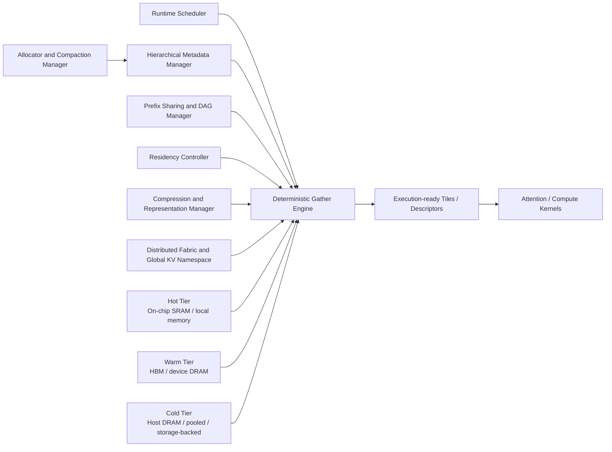

### Figure 2: Logical Namespace and Shared Lineage Structure

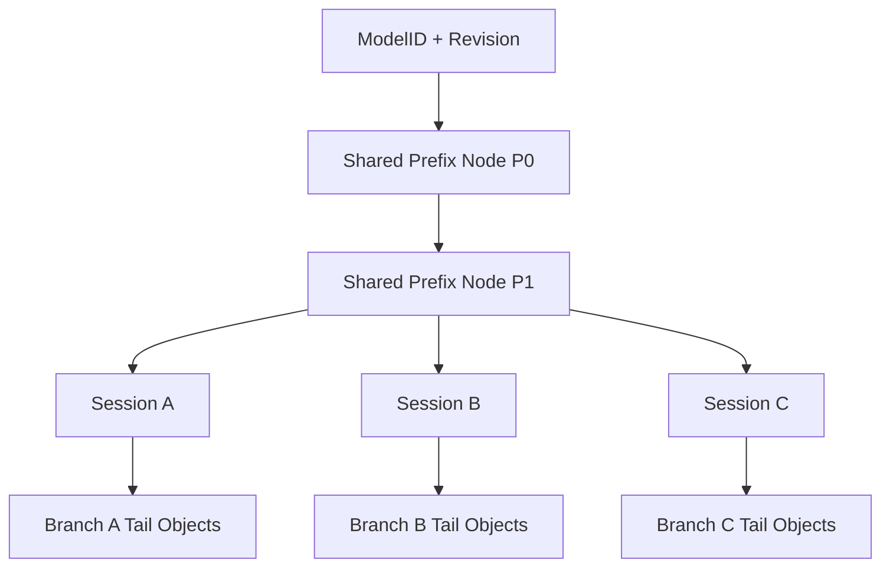

### Figure 3: Metadata Mapping Entry and Epoch Fields

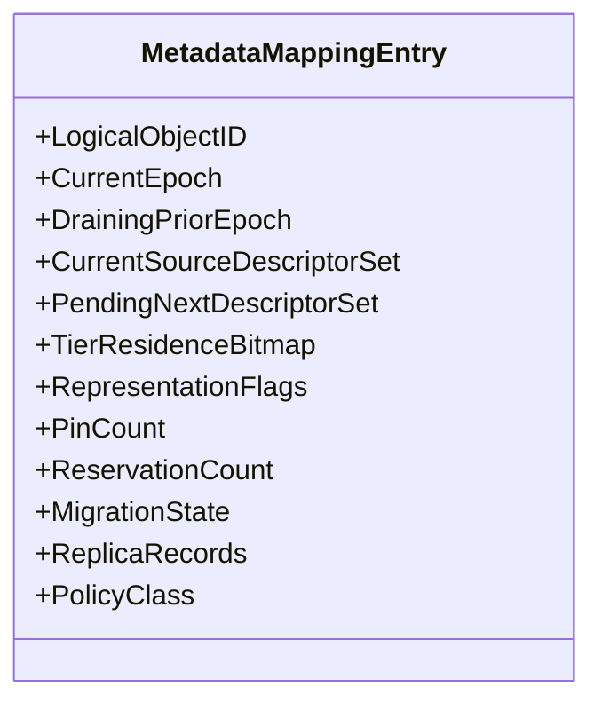

### Figure 4: Epoch Commit and Reader Drain Timeline

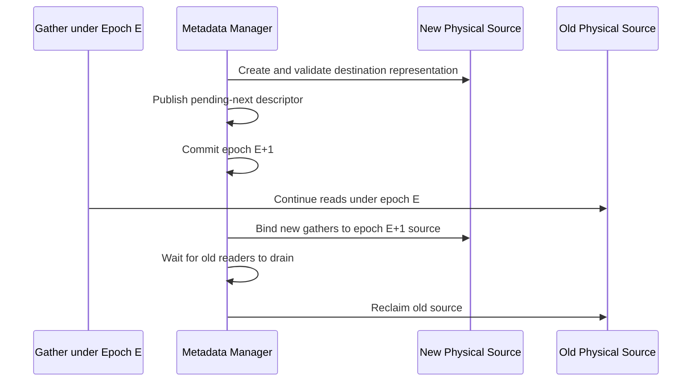

### Figure 5: Gather-Plan Compilation Pipeline

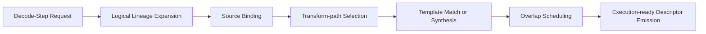

### Figure 6: Reusable Gather Template Structure

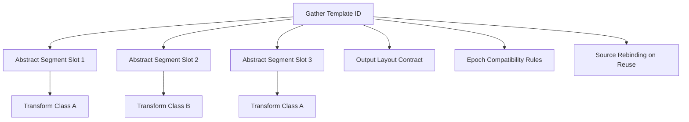

### Figure 7: Mixed-Tier Overlap Scheduling Diagram

```mermaid
gantt
    title Mixed-Tier Gather Overlap
    dateFormat  X
    axisFormat %s
    section Cold / Remote
    Remote fetch         :a1, 0, 6
    Cold-tier fetch      :a2, 0, 5
    section Warm
    HBM DMA              :b1, 1, 4
    section Transform
    Decompression        :c1, 4, 3
    Reformat             :c2, 5, 2
    section Hot / Output
    SRAM direct read     :d1, 1, 2
    Tile assembly        :d2, 5, 3
    Compute launch       :d3, 8, 1
```

### Figure 8: Single Accelerator Flagship Embodiment

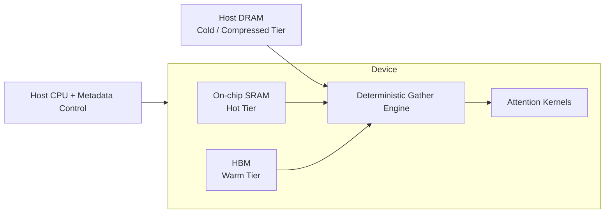
### Figure 9: Distributed Popular-Prefix Store Flagship Embodiment

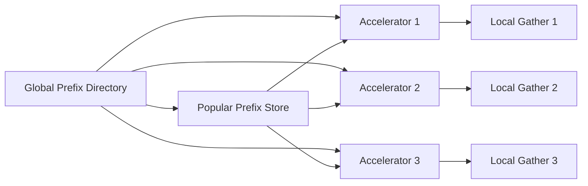

### Figure 10: Remote Fetch versus Local Replication Decision Blueprint

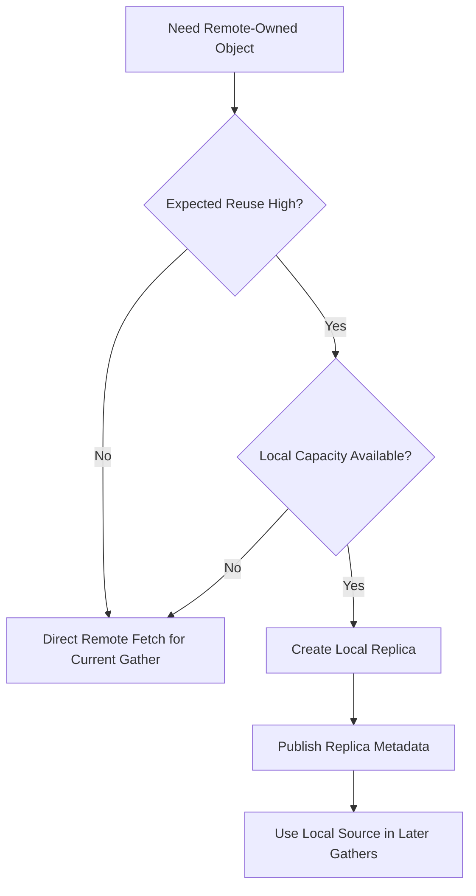

### Figure 11: Resumable Session with Compressed Cold Tier

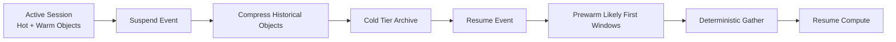

### Figure 12: Compute Interface Normalization

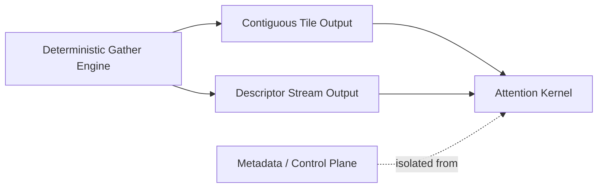

## Potential Claim Themes

- Deterministic gather of logically shared, tiered, and format-diverse KV objects into execution-ready tiles or descriptors.
- Separation of metadata/control traversal from compute execution, with gather as the bridging mechanism.
- Hierarchical logical mapping of KV objects with epoch-governed source publication.
- Reusable gather templates validated against metadata epochs and rebound to current sources.
- Mixed-tier overlap scheduling for hot, warm, cold, and remote sources during execution preparation.
- Remote fetch versus local replication policy integrated into gather source binding.
- Shared-prefix and branch-aware ownership of immutable historical KV objects.
- Relocation-safe logical mapping using pending-next descriptors and commit/drain semantics.
- Compression-aware gather planning with representation-specific transform paths.
- Resumable session management using compressed cold tiers and staged prewarm.
- Distributed popular-prefix storage integrated with hierarchical logical mapping and deterministic gather.

## Figure Plan

### Figure 1: Deterministic Gather-Centric System Architecture

Show the gather engine at the center of the architecture, receiving logical requests from the scheduler and delivering execution-ready artifacts to compute. Surround it with metadata hierarchy, residency controller, representation manager, allocator, tiers, and optional distributed fabric.

### Figure 2: Logical Namespace and Shared Lineage Structure

Show shared prefix roots, branch-local suffixes, logical object IDs, and layer/head-group mapping. Indicate that the same logical history can be represented by multiple physical sources over time.

### Figure 3: Metadata Mapping Entry and Epoch Fields

Present a detailed enlarged entry with logical ID, current epoch, pending-next descriptor, draining prior descriptor, tier bitmap, format flags, replica records, pin counts, and migration status.

### Figure 4: Epoch Commit and Reader Drain Timeline

Show a timeline of relocation or representation change from old source to new source, metadata commit, old-reader drain, and reclamation. This figure should support relocation-safe operation.

### Figure 5: Gather-Plan Compilation Pipeline

Show request parsing, lineage expansion, source binding, transform-path selection, template match, overlap scheduling, and descriptor emission. Include control-plane versus data-plane boundaries.

### Figure 6: Reusable Gather Template Structure

Show a template with abstract logical segment slots, transform classes, output layout contract, and rebinding process for new physical addresses and epochs.

### Figure 7: Mixed-Tier Overlap Scheduling Diagram

Provide a time-lane diagram for on-chip SRAM read, HBM DMA, host DRAM fetch, remote transfer, decompression, tile fill, and compute launch. Show critical-path prioritization.

### Figure 8: Single Accelerator Flagship Embodiment

Depict on-chip SRAM as hot tier, HBM as warm tier, host DRAM as cold compressed tier, and deterministic gather assembling an execution-ready tile from all three.

### Figure 9: Distributed Popular-Prefix Store Flagship Embodiment

Show multiple accelerators, a global prefix directory, local suffix objects, replica placement, and a gather plan combining shared remote/local prefix segments with local branch-local segments.

### Figure 10: Remote Fetch versus Local Replication Decision Blueprint

Show policy inputs including expected reuse, service class, link cost, and local space. Show resulting source-binding choice and metadata update path.

### Figure 11: Resumable Session with Compressed Cold Tier

Show active state demotion, compressed cold archival, resume index retention, prewarm of likely windows, and staged deterministic gather on resume.

### Figure 12: Compute Interface Normalization

Show contiguous tiles, descriptor streams, or DMA packets produced by the gather engine and consumed by attention kernels without metadata walking.

## Open Questions / Spots Needing Inventor Input

- Is the preferred commercial embodiment tile-materializing or descriptor-streaming at the gather output?
- What is the intended granularity for gather-template reuse: per layer, per layer group, per attention window, or per full decode step?
- Is there a preferred epoch publication mechanism already contemplated, such as pointer swap, versioned page publish, or readers-writer epoch tables?
- Are remote prefix replicas intended to be proactive, demand-driven, or hybrid?
- Is direct-stream decompression into final tile offsets a preferred embodiment worth emphasizing further?
- Should the strongest complete-spec embodiment include a concrete scoring formulation for remote fetch versus local replication?
- Are there preferred hardware assists for overlap scheduling, such as dedicated DMA channels or gather micro-engines?
- For resumable sessions, what cold-tier latency target is acceptable for the first resumed token, and does that influence the lead embodiment?
- Is the popular-prefix store expected to support cross-tenant sharing, tenant-scoped sharing, or both?
- Are there particular branch-heavy workloads, such as speculative decoding or agent-tree execution, that should be developed into separate dependent embodiments later?

## Recommended Short Filing Title

Systems and Methods for Deterministic Gather of Hierarchically Managed Key-Value State for Neural Network Inference

Alternative short titles:

- Systems and Methods for Deterministic Gather of Key-Value State for Autoregressive Neural Network Inference
- Systems and Methods for Hierarchical Management and Deterministic Gather of Key-Value State for Neural Network Inference
- Systems and Methods for Multi-Tier Deterministic Gather of Key-Value State for Neural Network Inference

## Draft Claims

The following draft claims are provided as a proposed complete-specification style claim set derived from the foregoing disclosure.

1. A computer-implemented system for autoregressive neural network inference, the system comprising:
   a memory arrangement storing key-value state as a plurality of logically managed key-value objects associated with prior token positions of one or more inference sequences;
   a hierarchical metadata manager configured to maintain logical-to-physical mappings for the logically managed key-value objects independently of current physical placement, the mappings indicating, for at least a subset of the logically managed key-value objects, one or more of a memory tier, a physical location, a representation state, an ownership state, and a version state;
   a deterministic gather engine configured, for an inference step, to resolve a logical access requirement for historical key-value state by traversal of the hierarchical metadata manager, to bind source key-value objects from one or more physical placements based on the logical-to-physical mappings, to determine any required transform path associated with the bound source key-value objects, and to generate an execution-ready output for a compute unit by assembling the bound source key-value objects in a predetermined order; and
   a compute interface configured to provide the execution-ready output to an attention operator or related neural network compute operator without requiring the compute operator to traverse the hierarchical metadata manager directly.

2. The system as claimed in claim 1, wherein the execution-ready output comprises one or more materialized tiles or buffers arranged in token order for direct consumption by the compute unit.

3. The system as claimed in claim 1, wherein the execution-ready output comprises a descriptor-form execution artifact selected from descriptor programs, DMA chains, ordered stream descriptors, hardware front-end command structures, and combinations thereof, the descriptor-form execution artifact specifying retrieval, transform, staging, or consumption order for the compute unit.

4. The system as claimed in claim 1, wherein the hierarchical metadata manager is configured to maintain the logical-to-physical mappings in a structure selected from a radix tree, a B+-tree, a page-table-like hierarchy, an extent map, and a hybrid thereof.

5. The system as claimed in claim 1, further comprising a prefix-sharing manager configured to maintain a shared lineage structure for common prompt prefixes used by a plurality of sessions, wherein the deterministic gather engine is configured to assemble a gather result from shared prefix objects and branch-local suffix objects without duplication of all underlying physical storage.

6. The system as claimed in claim 5, wherein the prefix-sharing manager is configured to support copy-on-write divergence or seal-and-fork divergence at a branch boundary.

7. The system as claimed in claim 1, further comprising a residency controller configured to control placement of the logically managed key-value objects across a plurality of memory tiers including at least a first tier and a second tier having different access characteristics, wherein the deterministic gather engine is configured to gather source key-value objects from a plurality of such memory tiers for the same inference step.

8. The system as claimed in claim 7, wherein the residency controller is configured to determine promotion, demotion, or pinning of a key-value object based on one or more of predicted gather reuse, service class, branch fan-out, remote-fetch cost, decompression cost, and prefix popularity.

9. The system as claimed in claim 1, further comprising a representation manager configured to maintain, for at least one logically managed key-value object, a representation descriptor indicating a representation class and a transform path, wherein the deterministic gather engine is configured to apply decompression, dequantization, reformatting, or transposition according to the representation descriptor before or during generation of the execution-ready output.

10. The system as claimed in claim 9, wherein a first representation of a key-value object is stored in a colder memory tier and a second representation of the same key-value object is stored in a warmer memory tier.

11. The system as claimed in claim 1, wherein the deterministic gather engine is configured to compile a gather plan specifying an ordered set of gather segments, corresponding source descriptors, corresponding transform actions, and corresponding output placements for the inference step.

12. The system as claimed in claim 11, wherein the gather plan further specifies overlap scheduling for at least two among remote transfer, cold-tier fetch, warm-tier transfer, decompression, reformatting, staging, and tile assembly.

13. The system as claimed in claim 11, wherein the deterministic gather engine is configured to reuse a gather template for recurrent logical access shapes, subject to validation of source compatibility and version compatibility.

14. The system as claimed in claim 13, wherein the gather template is associated with a granularity selected from per layer, per layer group, per token window, and per inference step.

15. The system as claimed in claim 1, wherein the hierarchical metadata manager is configured to maintain version transitions for at least one key-value object by publication of a next source descriptor set and continued availability of a prior source descriptor set for draining readers.

16. The system as claimed in claim 15, wherein the deterministic gather engine is configured to validate a compiled gather plan against a current metadata epoch before launch and, upon detecting a stale source binding, to perform segment-level rebinding or to regenerate the gather plan while preserving deterministic segment ordering.

17. The system as claimed in claim 15, wherein the version transitions are effected by a mechanism selected from pointer swap, versioned page publication, epoch table publication, shadow mapping publication, and combinations thereof.

18. The system as claimed in claim 1, further comprising an allocator and compaction manager configured to relocate a physically stored key-value object from a source extent to a destination extent while preserving logical identity by updating the hierarchical metadata manager.

19. The system as claimed in claim 18, wherein the allocator and compaction manager is configured to retain the source extent for prior-epoch readers until a reader drain condition is satisfied.

20. The system as claimed in claim 1, further comprising a distributed ownership manager configured to maintain a global logical namespace across a plurality of accelerators or nodes, wherein the deterministic gather engine is configured to bind a remotely owned source object or a local replica thereof for the inference step.

21. The system as claimed in claim 20, wherein the distributed ownership manager is configured to determine whether to use remote fetch or local replication based on one or more of expected reuse, link cost, latency class, local capacity, and popularity of a shared prefix.

22. The system as claimed in claim 20, wherein the distributed ownership manager is configured to invalidate or refresh stale replicas in response to an owner-epoch change or representation-version change.

23. The system as claimed in claim 1, wherein the deterministic gather engine is configured to generate the execution-ready output using source key-value objects that are shared among multiple sessions and source key-value objects that are private to a branch of one of the sessions.

24. The system as claimed in claim 1, wherein the logically managed key-value objects are blockized objects having fixed-size token extents.

25. The system as claimed in claim 1, wherein the logically managed key-value objects are extent-based objects having variable-size token extents.

26. A computer-implemented method for autoregressive neural network inference, the method comprising:
   maintaining key-value state as a plurality of logically managed key-value objects associated with prior token positions;
   maintaining, in a hierarchical metadata structure, logical-to-physical mappings for the logically managed key-value objects independently of current physical placement;
   receiving, for an inference step, a logical access requirement identifying historical key-value state required by an attention operator or related compute operator;
   resolving, by a deterministic gather engine and using the hierarchical metadata structure, source key-value objects corresponding to the logical access requirement;
   selecting, for at least one resolved source key-value object, a source binding and a transform path based on physical placement and representation state;
   generating, by the deterministic gather engine, an execution-ready output in a predetermined order from the resolved source key-value objects; and
   supplying the execution-ready output to the attention operator or related compute operator without requiring said operator to traverse the hierarchical metadata structure directly.

27. The method as claimed in claim 26, wherein generating the execution-ready output comprises materializing one or more execution-ready tiles or buffers.

28. The method as claimed in claim 26, wherein generating the execution-ready output comprises emitting a descriptor-form execution artifact selected from descriptor programs, DMA chains, ordered stream descriptors, hardware front-end command structures, and combinations thereof.

29. The method as claimed in claim 26, further comprising validating the source bindings against a current metadata epoch before execution and, upon detecting a stale source binding, rebinding an affected source segment or regenerating a gather plan.

30. The method as claimed in claim 26, further comprising gathering source key-value objects from multiple memory tiers for the same inference step.

31. The method as claimed in claim 30, further comprising overlapping at least two among remote transfer, cold-tier fetch, warm-tier transfer, decompression, reformatting, staging, and output assembly.

32. The method as claimed in claim 26, further comprising sharing a common prefix among multiple sessions by storing one or more sealed key-value objects once and gathering shared prefix objects together with branch-local suffix objects.

33. The method as claimed in claim 32, further comprising handling branch divergence by copy-on-write divergence handling or seal-and-fork divergence handling.

34. The method as claimed in claim 26, further comprising promoting a compressed cold-tier source object to a warm-tier representation before a subsequent deterministic gather.

35. The method as claimed in claim 26, further comprising selecting between remote fetch and local replication for a remotely owned source object in dependence upon predicted reuse, communication cost, or latency class.

36. The method as claimed in claim 26, further comprising reusing a gather template associated with a recurrent logical access shape.

37. A non-transitory computer-readable medium storing instructions which, when executed by one or more processors, cause performance of the method as claimed in any one of claims 26 to 36.

38. A distributed inference system comprising:
   a plurality of accelerators or nodes;
   a distributed ownership manager configured to maintain a global logical namespace for key-value objects across the plurality of accelerators or nodes; and
   at least one deterministic gather engine as claimed in claim 1 configured to resolve, for an inference step, a set of shared prefix objects and branch-local suffix objects from local or remote sources and to generate an execution-ready output therefrom.

39. The distributed inference system as claimed in claim 38, wherein the distributed ownership manager maintains epoch information for an owner copy and one or more replica copies of a key-value object.

40. The distributed inference system as claimed in claim 38, wherein a popular shared prefix is maintained as an immutable logical object and is selectively replicated across a subset of the plurality of accelerators or nodes for subsequent deterministic gather operations.

## Claim Drafting Notes

- Claim 1 is intended to force the point of novelty onto deterministic gather from logically managed objects, rather than onto blockization or paging alone.
- Claims 2 and 3 separately cover tile-materializing and descriptor-emitting embodiments.
- Claims 15 to 17 are intended to capture epoch-safe source publication and validation without overcommitting to a single implementation.
- Claims 20 to 22 are intended to distinguish over a mere distributed prompt store by requiring a distributed ownership layer that participates in deterministic gather source binding.
- Claims 26 to 40 provide parallel method, medium, and distributed-system coverage for later complete-specification use.
